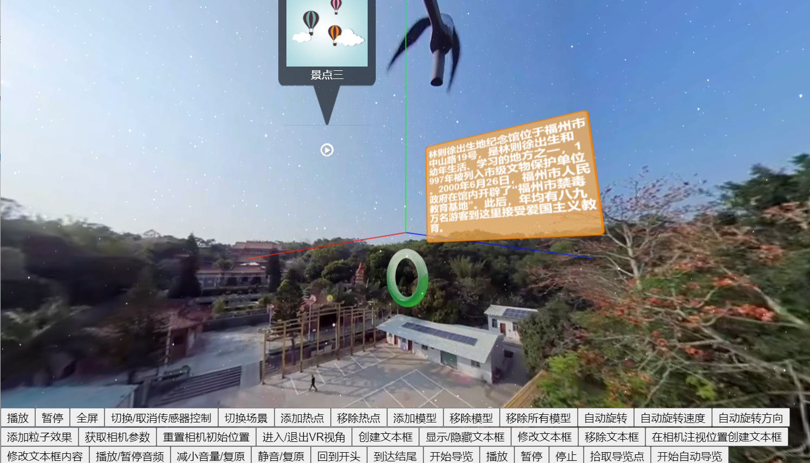

# XRPlayer XR全景互动直播React组件


## 一、关于

----
react-xrplayer 是一款功能丰富、架构合理的Web全景互动直播播放器。基于React以及Three.js等框架，以React组件方式输出能力。支持常见的全景直播能力，比如全景图片、点播以及直播，双目VR，热点标签点击、全景漫游等能力。

----




#### 动机与愿景

目前常见的全景主要以全景图片或者全景视频为主，常用在静态的讲解介绍等场景，观完即走，互动性不足。

react-xrplayer 旨在将更多的内容和互动形式融合到全景中，支持全景视频直播、三维动画、三维模型、AR、WebVR等更丰富的XR能力。同时，react-xrplayer 不仅仅只是简单的全景播放器，同时还具备全景编辑能力，react-xrplayer在设计中还会充分考虑对编辑器的支持能力。

#### 关联项目

基于react-xrplayer的关联项目
- 基于react-xrplayer开发的全景互动编辑器
- 基于react-xrplayer开发的全景互动观看端

## 二、特性与规划

- 支持全景图片、全景视频、全景直播。
- 支持多种全景视角控制
- 支持PC与移动端浏览器
- 支持多种全景展示效果
- 支持3D模型展示
- 支持热点标签、视频弹窗、文本弹窗等
- 支持双目VR展示与交互
- 支持全景漫游
- 支持标准化、格式化的参数编辑与导入导出（配套项目）
- 支持远程实时控制（配套项目）

在线DEMO展示地址: [react-xrplayer](http://client.youmuvideo.com/react-xrplayer/)


P.S. 目前react-xrplayer仍处于原型开发阶段，不建议直接在生产环境中直接集成使用，敬请期待V1.0版本的发布。同时也欢迎一起讨论、设计以及贡献代码。

[features-and-todos](./doc/feature-and-todo.md) 这里更详细地记录了react-xrplayer的能力规划以及目前的支持情况，你可以查看相关feature的完成情况，同时也方便你了解当前react-xrplayer的开发进展，pick你感兴趣的todo，并贡献你的代码。


## 三、快速集成使用

#### 1. 安装react-xrplayer库

```js
npm install react-xrplayer
```

#### 2. 以组件方式使用

```js
import React from 'react';
import XRPlayer from 'react-xrplayer'
class App extends React.Component {
    render() {
        return (
            <div>
                <XRPlayer
                    width="100vw"
                    height="100vh"
                    scene_texture_resource={{
                        type: 'hls',
                        res_url: 'http://cache.utovr.com/s1e3tzoku70yk8mpa3/L3_5dxsrk4kh56gc4l1_v2.m3u8'
                    }}
                ></XRPlayer>
            </div>
        )
    }
}
export default App;
```

#### 3. 详细接入与开发文档

更多丰富的功能实现，请查阅react-xrplayer的[接口设计与开发文档](./doc/api-doc.md)

我们开始使用JSdoc来自动生成API文档，[API](./jsdoc/index.html)， 生成JSDoc文档
```js
npm run jsdoc
```

## 四、播放器架构
（播放器的架构设计图,待定）

## 五、运行代码

#### 1. 安装依赖

```js
npm install
```

#### 2. 本地运行example

```js
npm run start
```
浏览器打开地址`http://localhost:3000/react-xrplayer`

#### 3. 编译React库

```js
npm run compile
```
可选，生成的可发布到npm库位于`/lib`文件夹中

#### 4. 打包项目

```js
npm run build
```
可选，打包好的项目位于`/build`文件夹中

## 六、贡献代码

#### 如何贡献您的代码
1. Fork代码到您的github，并 git clone 到本地。
2. 在添加您的代码之前，先切换到dev分支，并以dev分支为基，创建您的feature分支。
3. 在feature分支上完成您的feature开发，提交到您的github，并merge到dev分支。
4. 同步主仓库dev分支上的更新到您的dev分支。
5. 检查是否存在冲突，如果存在，解决冲突。
6. 从您的dev分支向主仓库的dev分支发起pull request。
7. 我们会尽快回复您的pul request。

#### contributors
[@zwboy](https://github.com/ZWboy97) [@bigint405](https://github.com/bigint405)
